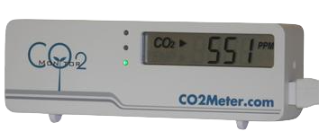

# c02cli

This builds off of the [`co2mon`](https://github.com/dmage/co2mon) logger by [Oleg Bulatov](https://github.com/dmage).

This macOS Swift CLI project was primarily designed to get the kinks out of embedding the `hid` and `co2mon` code components into an Xcode project for an eventual GUI/menubar-based app.  

Swift is in charge of the event loop.

This has been tested with the [RAD-301 'CO2Mini Indoor Air Quality Monitor'](https://www.co2meter.com/collections/desktop/products/co2mini-co2-indoor-air-quality-monitor) from CO2Meter.com

